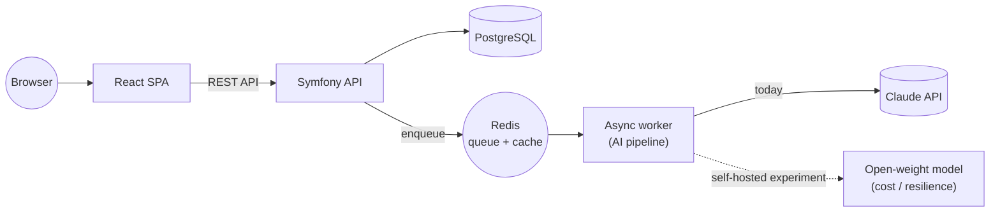
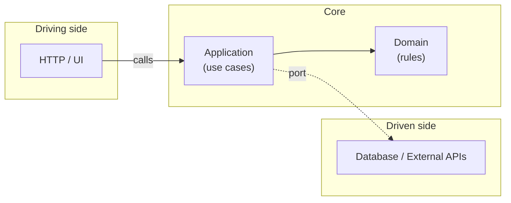
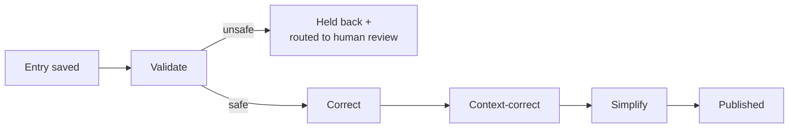
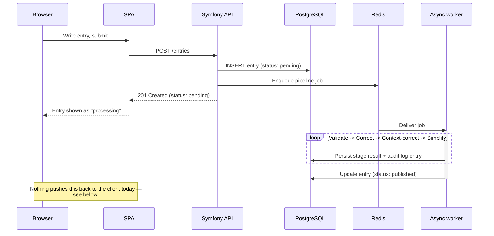
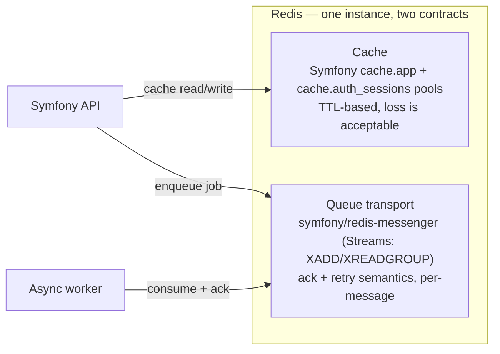
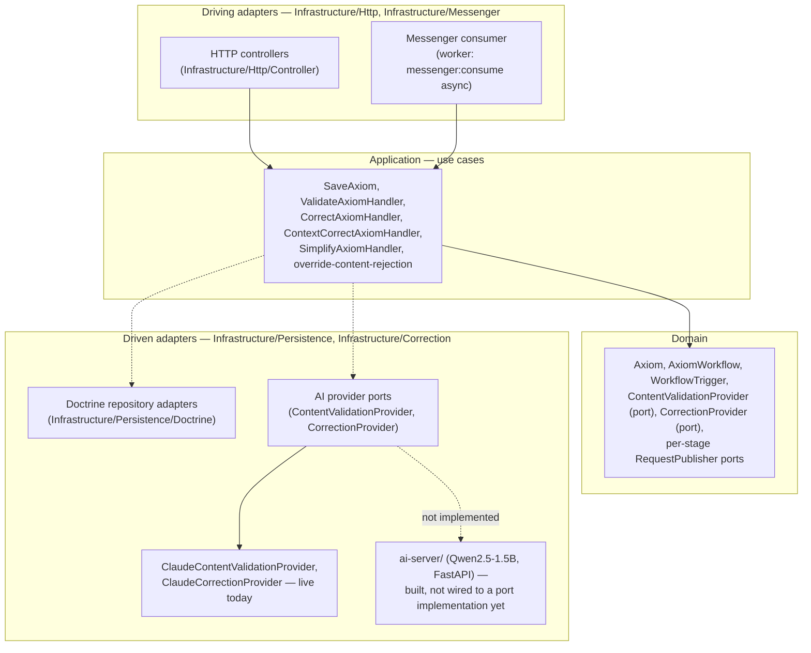
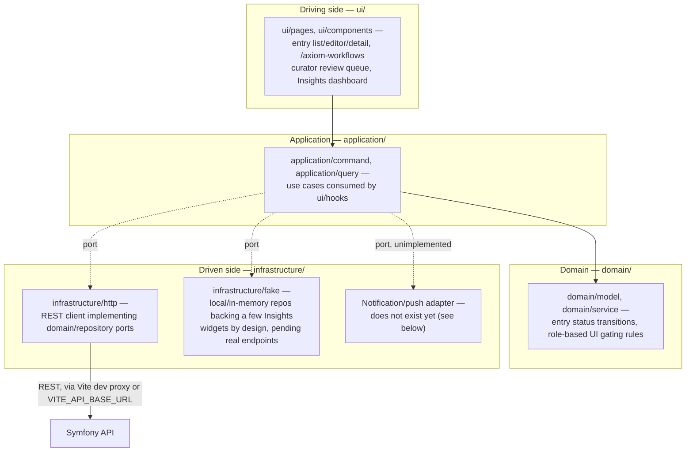

# Architecture

Sutras is a small, deliberately boring system in the places that don't matter, and careful in the one place that does: the pipeline that turns a rough thought into something worth keeping.

## Overview

The product is two applications talking to one API: a React SPA where you write and browse entries, and a Symfony backend that owns the data and orchestrates an asynchronous AI pipeline over everything you save. Postgres holds the durable data; Redis does double duty as cache and message transport for a background worker that runs the AI pipeline off the request path, so saving an entry is instant and the "thinking" happens after.

## Design philosophy: ports & adapters

Both apps are built hexagonal — business rules live in a framework-free core (`domain` + `application`), and everything that talks to the outside world (HTTP controllers, the database, the UI framework, the AI provider) is an adapter plugged in at the edge through an interface. The core never imports an adapter; it depends on a port, and an adapter implements it.

This isn't architecture for its own sake — it buys three things that matter for a product still finding its shape:

- **The core is testable without booting anything.** Business rules are plain classes, tested directly, no framework, no HTTP, no database.
- **Adapters are swappable without a rewrite.** The AI provider behind the pipeline is a port, not a hardcoded call — see below. So is persistence, so is the delivery mechanism.
- **A future split stays mechanical.** If the frontend and backend ever need to move into separate repos, or a mobile client joins the React SPA, the boundary is already drawn.

## The AI pipeline

This is the part of the system actually worth showing. Every entry a user writes goes through four sequential, asynchronous passes before it's considered finished:

1. **Content-safety validation** — a gate, not a suggestion. If this fails or errors, the entry is rejected outright and never proceeds.
2. **Grammar & wording correction** — tightens the raw thought into something readable.
3. **Technical-accuracy correction** — a second pass focused on correctness, not just prose.
4. **Simplification** — makes sure the final entry is still readable months later, out of context.

Each stage only runs if the previous one succeeded — a failure after validation just stops the chain, no partial or corrupted output ever reaches the user. Every attempt, at every stage, is written to an append-only audit log, so both the entry's owner and a curator can see exactly what happened and why. Content that fails validation isn't silently dropped: it's flagged, the entry's author is protected from publishing something unsafe, and a curator is notified and can review and clear it.

The pipeline runs against the Claude API today. Because the AI step sits behind a port rather than a direct dependency, there's a self-hosted alternative already being prototyped — small open-weight models running the same four prompts on commodity CPU hardware — as a path to lower per-entry cost and less single-vendor exposure as usage grows, without touching anything upstream of that port.

## How data actually travels

The diagrams above show the boxes; this is the sequence between them for the one flow that matters — writing an entry.

> **Resolved, and the answer is "nothing yet":** confirmed directly against the frontend source, not just undocumented — there is no polling loop, no `EventSource`/SSE, and no `WebSocket` client anywhere in `frontend/src/`. The only interval timer in the codebase belongs to an unrelated homepage widget. A user currently learns an entry finished only by reloading or revisiting the page. See [Decisions](decisions.md#how-pipeline-completion-reaches-the-client-still-unresolved) for why this was left open rather than guessed at, and [Roadmap](roadmap.md#next) for where it sits in priority.

## Redis: cache and queue, one instance

The overview above says Redis "does double duty as cache and message transport," but a cache and a queue want opposite things from the same store: a cache is fine to lose (TTL, eviction under memory pressure); a queued pipeline job is not — losing one silently drops an entry mid-pipeline with no user-visible error.

> **Resolved — partially good news:** the queue side is backed by `symfony/redis-messenger`, which uses Redis Streams (`XADD` to publish, `XREADGROUP` with a consumer group to consume) rather than plain pub/sub, so message delivery itself has ack/retry semantics — a worker crash mid-job doesn't lose that job. **But** the production Redis pod runs with no PersistentVolumeClaim at all — it's in-memory only. The cluster's node autoscaler routinely reschedules pods as it scales the node pool between 1 and 3 nodes, and every time the Redis pod restarts, both the cache (expected) and any not-yet-consumed stream entries (not expected — a silent, user-invisible loss) disappear together. The transport mechanism is durable; the instance running it today isn't. See [Decisions](decisions.md#redis-cache-and-queue-on-one-instance-with-no-persistence-in-production).

## Component view: backend

The hexagonal diagram earlier is the pattern; this is how it actually maps onto the Symfony modules under `backend/src/`. One naming note before the diagram: the domain's core entity is called `Axiom` in the code — the product itself renamed "Sutra" to "Axiom" in v0.1.0 (new logo, new visual style at the same time) — while this doc, like the rest of the product surface, still calls it an "entry." If you're reading the actual source alongside this page, `Axiom` is the class you're looking for.

## Component view: frontend

Same shape on the SPA side (`frontend/src/{domain,application,infrastructure,ui}`), and it does hold up — enforced not just by convention but by `@domain/@application/@infrastructure/@ui` TypeScript path aliases, so an import reaching the wrong direction is visible in a diff, not just in code review discipline.

The `Notif` adapter is the concrete shape of the [pipeline-completion open question](#how-data-actually-travels) — there's a port-shaped gap in the diagram because there's a real gap in the code: no adapter has been written for it yet.

## Why it's built this way

The interesting engineering problem here isn't CRUD — it's turning unstructured, sometimes-unsafe user input into something trustworthy enough to publish, without a human in the loop on the happy path, while keeping a human very much in the loop the moment something looks wrong. That tradeoff — automate aggressively, but fail closed and leave an audit trail — is the actual design decision behind everything above.

## What's next

The architecture is intentionally ahead of the product surface: the pipeline, the audit trail, and the review tooling are built for a scale of usage the product doesn't have yet. Current focus is less on the plumbing and more on the parts users see day to day — a browsing experience that makes a growing library of entries feel navigable, and lightweight nudges toward what to learn next. See [Decisions](decisions.md) for the specific infrastructure tradeoffs behind this, and [Scaling](scaling.md) for what changes as usage grows.

## References

Concepts used throughout this page, for anyone new to them:

- [C4 model](https://c4model.com/) — the Context → Container → Component → Code leveling this page loosely follows (Overview = Context/Container, the Component-view sections = Component).
- [arc42](https://arc42.org/) — the broader template this whole `docs/` split (architecture, decisions, deployment, scaling, operations, cost) is modeled after.
- [Hexagonal Architecture (Ports & Adapters)](https://alistair.cockburn.us/hexagonal-architecture/) — Alistair Cockburn's original write-up; the source of the driving/core/driven vocabulary used in the design-philosophy and component diagrams.
- [Architecture Decision Records](https://adr.github.io/) — the format `decisions.md` follows (context / decision / tradeoff per entry).
