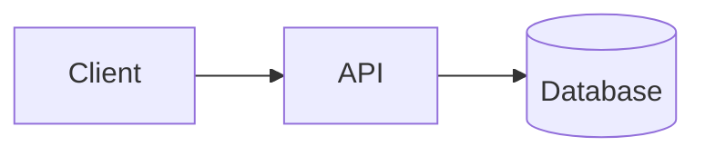

# Architecture

How Sutras is structured: backend, frontend, and the AI processing pipeline that sits behind the core product.

## Overview

> TODO: one-paragraph summary of the system — what the app does end-to-end, at a glance.

## Backend

> TODO: language/framework, layering approach (e.g. hexagonal/ports-and-adapters), how domain logic is isolated from infrastructure.

## Frontend

> TODO: framework, structure, how it talks to the backend.

## AI processing pipeline

> TODO: describe the async correction/processing pipeline — stages, what triggers it, what runs where.

## Diagram

> TODO: add a Mermaid diagram of the high-level system (see `diagrams/`).

