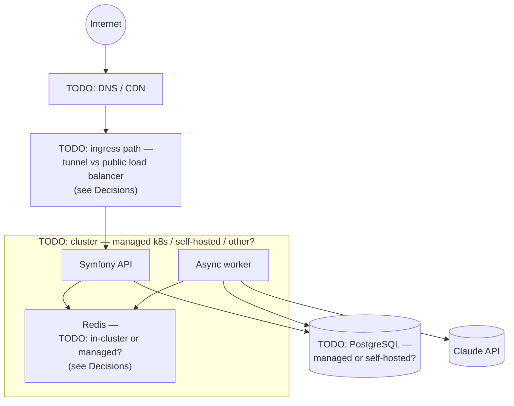
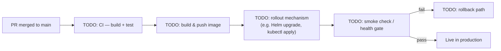

# Deployment

Where Sutras runs, and how a change gets from a merged PR to production. This is the deployment-diagram counterpart to the container view in [Architecture](architecture.md) — same containers, now placed onto real infrastructure.

## Deployment view

> Every unlabeled TODO here is a real open question already anticipated (but not answered) in [Decisions](decisions.md): cluster choice, Redis placement, the ingress path. Fill in the boxes once those decisions are actually made — don't invent them here just to make the diagram look finished.

## Environments

| Environment | Purpose | Hosting | Notable differences |
|---|---|---|---|
| Local | TODO | TODO | TODO |
| Staging | TODO | TODO | TODO |
| Production | TODO | TODO | TODO |

## Production infrastructure

> TODO: compute (cluster/hosting), database, caching, ingress/DNS/CDN. The deployment-view diagram above is the skeleton — fill in the prose detail here once the boxes have real names.

Related: [Redis: cache and queue, one instance](architecture.md#redis-cache-and-queue-one-instance) in Architecture, and the matching entry in [Decisions](decisions.md#redis-cache-and-queue-on-one-instance) once it's written.

## Release process

> This repo's own CI (`.github/workflows/deploy-docs.yml`) only deploys this documentation site via `mkdocs gh-deploy` — it says nothing about how the actual Sutras app ships. Don't reuse it as evidence for this section; it's a different pipeline entirely.

## Secrets & configuration

> TODO: how secrets are managed per environment (no actual secret values here — just the mechanism, e.g. which secrets manager, how a secret reaches a running pod/process).

## References

- [C4 model — Deployment diagrams](https://c4model.com/diagrams/deployment) — the diagram style used above: containers (from [Architecture](architecture.md)) mapped onto infrastructure nodes. This is the one place C4 genuinely extends past the four core levels into infra.
- [The Twelve-Factor App](https://12factor.net/) — the standard the Environments and Secrets sections should conform to once filled in (config via environment, strict dev/staging/prod parity).
- [Decisions](decisions.md) — the "why" behind every TODO box in the deployment view above.
