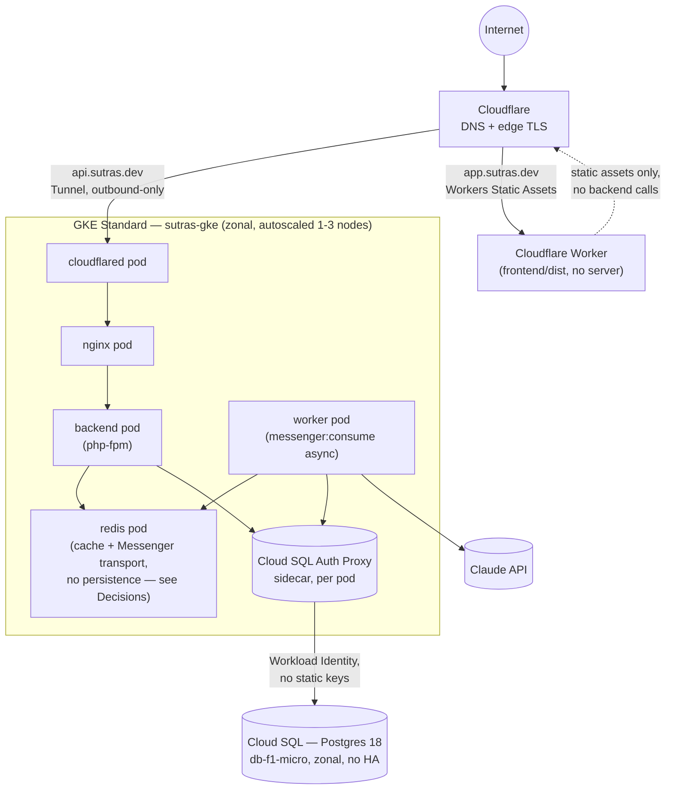
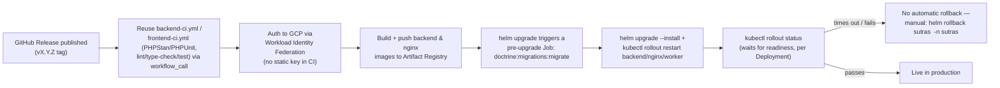

# Deployment

Where Sutras runs, and how a change gets from a merged PR to production. This is the deployment-diagram counterpart to the container view in [Architecture](architecture.md) — same containers, now placed onto real infrastructure.

## Deployment view



No GKE Ingress and no GCP load balancer exist in this picture at all — that absence is deliberate, not missing. See [Decisions](decisions.md#ingress-path-cloudflare-tunnel-workers-not-a-gcp-load-balancer).

## Environments

| Environment | Purpose | Hosting | Notable differences |
|---|---|---|---|
| Local | Day-to-day development | Docker Compose, 8 services on one bridge network | Bind-mounted source, hot reload; `APP_ENV=prod` can be set on the same containers for a partial prod-like approximation, but it doesn't build the production Dockerfiles or drop the bind mounts |
| UAT | Pre-release validation, and a place to build real AWS experience | AWS: ECS Fargate + RDS + ElastiCache, behind an ALB, Cloudflare DNS in front | Only exists when someone runs `terraform apply` for it — not always-on (see [Decisions](decisions.md#dual-cloud-split-aws-for-uat-gcp-for-production-and-aws-only-runs-on-demand)); deployed and torn down manually, no CI trigger |
| Production | Live app | GCP: GKE Standard + Cloud SQL, Redis in-cluster, Cloudflare Tunnel + Workers | The only environment deployed automatically, on a GitHub Release tag |

## Production infrastructure

**Compute** — a single zonal GKE Standard cluster (`sutras-gke`, one region-locked zone, not a regional cluster — see [Cost Analysis](cost-analysis.md) for why), with one node pool autoscaled between 1 and 3 `e2-standard-2` nodes (2 vCPU / 8GB each). `auto_repair` is on; `auto_upgrade` is deliberately off, so node-pool version bumps are a conscious, manual action rather than something GKE does silently. Workload Identity lets pods authenticate to GCP APIs (specifically the Cloud SQL Admin API) without any static service-account key ever existing on disk. Every workload — `backend`, `nginx`, `worker`, `redis`, `cloudflared` — is a `replicaCount: 1` Deployment defined in one Helm chart (`infrastructure/gcp/helm/sutras/`); there is no HorizontalPodAutoscaler anywhere in the chart, so scaling under load today only happens at the node level, never at the pod level.

**Database** — Cloud SQL for Postgres (currently Postgres 18), tier `db-f1-micro`, **zonal availability (no HA)**, 10GB SSD, automated daily backups enabled at 03:00. Reached exclusively through a Cloud SQL Auth Proxy sidecar container in each pod that needs it (`backend`, `worker`, the migration Job) — never by IP allowlisting. That's not a stylistic choice: an earlier setup using authorized-networks IP allowlisting caused a real outage when a node replacement got a new external IP that hadn't been allowlisted yet; the Auth Proxy + Workload Identity approach removes that failure mode entirely.

**Caching & queue** — Redis runs as a single, unpersisted in-cluster pod, serving both the Symfony cache and the async Messenger transport. See [Architecture](architecture.md#redis-cache-and-queue-one-instance) for the mechanism and [Decisions](decisions.md#redis-cache-and-queue-on-one-instance-with-no-persistence-in-production) for the real gap this leaves open.

**Networking / ingress** — no GKE Ingress, no GCP load balancer, no static IP. The API is exposed through an outbound-only Cloudflare Tunnel (`cloudflared` pod); a `NetworkPolicy` default-denies all ingress except the specific pod-to-pod paths the app actually needs (`cloudflared`→`nginx`, `nginx`→`backend`, `backend`/`worker`→`redis`). Egress is left open on purpose — the nodes have public IPs and no NAT Gateway, which is itself a cost-driven choice mirrored on the AWS side.

**Frontend hosting** — not part of the cluster at all. The built static bundle (`frontend/dist/`) deploys straight to a Cloudflare Worker (Workers Static Assets, not Cloudflare Pages) bound to `app.sutras.dev`; Cloudflare issues the DNS record and TLS cert for that binding automatically.

**AWS/UAT, when it's running** — a VPC across 2 AZs (public + private subnets), a NAT Gateway for private-subnet egress, ECS Fargate running three services (`backend`, `nginx`, `frontend`) behind an HTTPS-only ALB (TLS 1.3 policy, HTTP→HTTPS redirect), RDS (`db.t4g.micro`, encrypted at rest) and ElastiCache (`cache.t4g.micro`, 2-node replication group, encrypted at rest) both in private subnets. Container Insights is explicitly disabled — a one-line cost decision documented right next to the Terraform resource that would enable it.

## Release process



Releases are cut **per app**, with a prefixed git tag (`backend-vX.Y.Z` or `frontend-vX.Y.Z`) that publishing a GitHub Release turns into a `release: types: [published]` event, triggering `.github/workflows/backend-release.yml` or `frontend-release.yml`. Both workflows are thin wrappers around `make` targets (`make/release-gcp.mk`) — runnable locally with the same commands CI uses, useful for debugging a failed release without waiting on GitHub Actions:

```sh
make tf-gcp-init
make release-gcp TAG=<git-sha-or-version>   # backend: build, push, migrate, deploy
make release-frontend                        # frontend: build, deploy to Cloudflare
```

The `helm upgrade` timeout is set to 600s specifically to cover the node-pool autoscaler provisioning a fresh node (2–5 minutes) if a deploy needs more capacity than currently exists, on top of the migration Job actually running — Helm's 5-minute default was cutting that too close in practice.

**There is no automated health gate or rollback.** `kubectl rollout status` will fail the CI job if the new pods never become ready, but nothing automatically reverts to the previous image on that failure — see [Operations](operations.md#rolling-back) for the manual `helm rollback` path, and a production Playwright smoke suite (`e2e/`, `npm run test:production`) exists but is triggered by hand, not wired into the release pipeline yet.

AWS/UAT has no equivalent automated release workflow at all — deploying there is the manual Terraform + `make release-aws` flow, run locally.

> This repo's own CI (`.github/workflows/deploy-docs.yml`) only deploys this documentation site via `mkdocs gh-deploy` — a separate, unrelated pipeline from everything above.

## Secrets & configuration

- **AWS/UAT** — `DATABASE_URL`, `REDIS_URL`, and `APP_SECRET` live in SSM Parameter Store; nothing is ever written into a task-definition literal or committed to the repo.
- **GCP/production** — application secrets are delivered to pods as Kubernetes Secrets (`sutras-secrets`, `cloudflare-tunnel-credentials`), referenced via `envFrom.secretRef` in the Helm templates rather than baked into `values.yaml`. Database credentials specifically don't need a secret at all in the traditional sense — the Cloud SQL Auth Proxy sidecar authenticates over Workload Identity, so no DB password ever needs to reach the pod as an env var. The Kubernetes Secret objects themselves are created by hand (`kubectl create secret ...`), not generated by Terraform or Helm — there's no sealed-secrets/External Secrets Operator/Vault layer yet, which is worth knowing if you're the one rotating them.
- **Local dev** — Symfony's standard `.env` < `.env.dev` < `.env.local` layering; only `.env.local`/`.env.*.local` are gitignored, everything else is committed defaults pointed at the Compose service names.

## References

- [C4 model — Deployment diagrams](https://c4model.com/diagrams/deployment) — the diagram style used above: containers (from [Architecture](architecture.md)) mapped onto infrastructure nodes. This is the one place C4 genuinely extends past the four core levels into infra.
- [The Twelve-Factor App](https://12factor.net/) — the standard the Environments and Secrets sections should conform to once filled in (config via environment, strict dev/staging/prod parity).
- [Decisions](decisions.md) — the "why" behind every TODO box in the deployment view above.
